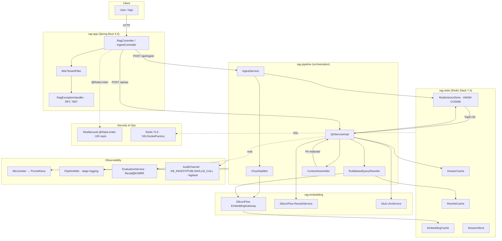

# spring-ai-alibaba-rag

> **Spring Boot 3 + Spring AI Alibaba + Redis Stack** 企业级向量检索与 RAG 引擎
>
> 落地实现 — 详见 [设计 Spec](./docs/superpowers/specs/2026-06-16-spring-ai-alibaba-rag-design.md)
> 来源文章 — 微信公众号「Ray 的银河技术」《Spring Boot + Spring AI Alibaba + Redis 企业级向量检索与 RAG 引擎实战》

---

## 架构总览



---

## 快速开始

### 0. 前置依赖

- **JDK 21** + **Maven 3.9.9** (自装)
- **Docker** (用于 Redis Stack 7.4 容器)
- **SiliconFlow API Key** (可选 — 不填也能跑，只走 stub 路径)

### 1. 克隆 + 编译

```bash
git clone https://github.com/yysf1949/spring-ai-alibaba-rag.git
cd spring-ai-alibaba-rag
mvn clean verify -DskipTests        # ~45s,纯编译
mvn verify                          # 全测,~45s,IT 默认跳过
```

### 2. 起 Redis Stack

```bash
# 已有 rag-redis-stack 容器直接复用;否则:
docker run -d --name rag-redis-stack -p 6379:6379 -p 8001:8001 \
    redis/redis-stack:7.4.0-v1

# 验证
docker exec rag-redis-stack redis-cli MODULE LIST | grep search
```

### 3. 启动应用

```bash
# 方式 A — Maven 直接跑 (使用 .rag-runtime/secrets.env 注入 SILICONFLOW_API_KEY)
mvn -pl rag-app spring-boot:run

# 方式 B — Docker Compose
docker compose up -d app

# 健康检查
curl http://localhost:8080/actuator/health
# → {"status":"UP"}

# 看 audit log (KB_INGEST / KB_PUBLISH / LLM_CALL 事件,90 天滚动)
tail -f logs/audit.log
```

### 3a. 启用 Redis TLS (生产推荐)

```bash
# 1) 生成 truststore
keytool -importcert -alias redis-ca -file redis-ca.pem \
    -keystore redis-truststore.p12 -storetype PKCS12 -storepass changeit -noprompt

# 2) 启动时注入
export REDIS_TLS_ENABLED=true
export REDIS_TLS_TRUSTSTORE=/path/to/redis-truststore.p12
export REDIS_TLS_TRUSTSTORE_PASSWORD=changeit
export REDIS_TLS_VERIFY_HOSTNAME=true

java -jar rag-app/target/rag-app-*.jar
# 启动期 fail-fast:truststore 缺失或 password 错时直接退出,不会带病上线
```

完整步骤见 [RUNBOOK §6.7](./docs/RUNBOOK.md#67-tls--production-rollout-redis--llm)。

### 4. 跑退款规则 demo (spec §18)

```bash
./scripts/demo-refund-qa.sh
# 或单元测试形式:
mvn -pl rag-test test -Dtest=RefundRuleEndToEndTest
```

---

## 模块结构

| Module | 职责 | 关键依赖 |
|---|---|---|
| `rag-core` | 领域模型 + port 接口 (无 Spring / 无 Redis / 无 LLM) | 无 |
| `rag-redis` | Redis Stack 向量存储 + 3 层缓存 + 会话 | Lettuce + Jedis + RediSearch |
| `rag-embedding` | Stub + SiliconFlow 真实实现 (Embedding / Rerank / LLM) | WebClient + Jackson |
| `rag-pipeline` | 编排 (Ingest / Rewrite / Rerank / ContextAssember / QA) | rag-core + rag-redis + rag-embedding |
| `rag-app` | Spring Boot 装配 (HTTP / MDC / OpenAPI / RFC 7807) | 全栈 |
| `rag-test` | 集成测试 + §18 退款规则 demo | Testcontainers + testcontainers-redis |
| `rag-agent` (Phase 10) | Agent Action Layer — 业务工具 (订单/退款/优惠券/物流) + 人工转接 + 评估指标 (3 层架构 + 4 级风险分级 + 治理层扩展) | Spring AI 1.0.9 + Micrometer + Jedis |

---

## 16 节映射表 (Spec vs 实现)

> 来源文章 22 节,其中 §1-5 为背景/概念,本表从 **§6 架构** 开始映射.
> spec 全集见 [设计 spec §3 目录结构](./docs/superpowers/specs/2026-06-16-spring-ai-alibaba-rag-design.md).

| 文章节 | 主题 | 实现位置 | 状态 |
|---|---|---|---|
| §6 | 架构总览 | 本 README 架构图 + [docs/architecture.md §1](./docs/architecture.md) | ✅ |
| §7 | 12 条架构原则 | [docs/design-principles.md](./docs/design-principles.md) + 各 module `package-info.java` | ✅ |
| §9 | 摄入链设计 | `rag-pipeline/src/main/.../ingest/IngestServiceImpl.java` | ✅ |
| §10 | 摄入链时序 (异步 / ChunkSplitter / 灰度发布) | `IngestServiceImpl` + `IngestJobExecutor` + `ChunkSplitter` | ✅ |
| §11 | 在线问答链 | `QAServiceImpl` + `RuleBasedQueryRewriter` + `RerankService` + `ContextAssembler` | ✅ |
| §12 | Redis 索引设计 (HNSW + 元数据) | `rag-redis/src/main/.../vector/RedisIndexManager.java` + [RUNBOOK §3](./docs/RUNBOOK.md) | ✅ |
| §13 | 全套代码 (领域模型 / Port / Adapter / Pipeline / App) | 6 个 module 的 `src/main` + [docs/README.md §Module Map](./docs/README.md) | ✅ |
| §14 | 高并发 + 降级 + 韧性 | Resilience4j 包装 (cluster 6) + [docs/architecture.md §3](./docs/architecture.md) | ✅ |
| §15 | 多租户 + 权限 + 脱敏 | `MdcTenantFilter` + `RedisVectorStore.search()` 过滤链 + `SensitiveDataRedactor` + [docs/MULTI_TENANT.md](./docs/MULTI_TENANT.md) | ✅ |
| §16 | 可观测性 (Micrometer + 日志 + 评估) | `rag.qa.*` / `rag.ingest.*` / `rag.embedding.*` 指标 + `PipelineMdc` + `AuditChannel` + `EvaluationService` + [docs/METRICS.md](./docs/METRICS.md) + [docs/observability.md](./docs/observability.md) | ✅ |
| §16a | Audit log (KB_INGEST/KB_PUBLISH/LLM_CALL/TENANT_CONFIG_CHANGE) | `rag-core/.../AuditEvent` + `rag-app/.../AuditChannel` + `logback-spring.xml` + `LlmAuditHook` port | ✅ |
| §16b | Redis TLS (Jedis SSLSocketFactory + auto-config) | `rag-redis/.../RedisSslAutoConfiguration` + `RedisConnection.init(SSLSocketFactory)` + [RUNBOOK §6.7](./docs/RUNBOOK.md#67-tls--production-rollout-redis--llm) | ✅ |
| §17 | 部署 (Docker + Compose + K8s) | `Dockerfile` + `docker-compose.yml` + [docs/deployment.md](./docs/deployment.md) | ✅ |
| §18 | 真实案例 (退款规则 QA) | `rag-test/.../RefundRuleEndToEndTest.java` + `scripts/demo-refund-qa.sh` | ✅ |
| §19 | 高频坑 | [docs/faq.md](./docs/faq.md) + [docs/LESSONS.md](./docs/LESSONS.md) (14 节实战 + P35 + C8-C10) | ✅ |
| §20 | 演进路径 | [docs/evolution.md](./docs/evolution.md) | ✅ |
| §21 | 生产落地 checklist | [docs/checklist.md](./docs/checklist.md) | ✅ |

---

## 测试覆盖

| Module | 测试文件数 | 关键测试 |
|---|---|---|
| rag-core | 3 | `ChunkTest`, `QueryTest`, `DocumentTest` |
| rag-embedding | 2 | `SiliconFlowEmbeddingGatewayTest` (mock WebClient) |
| rag-redis | 6 | `RedisVectorStoreSmokeTest` + `RedisSslAutoConfigurationTest` (4) + ... |
| rag-pipeline | 16 | `QAServiceImplTest` + `QAServiceImplAuditHookTest` (3) + `RateLimiter` + ... |
| rag-app | 4 | `RagControllerSmokeTest` + `AuditChannelTest` (6) + `IngestControllerMetricsAndAuditTest` (3) + ... |
| rag-test | 2 | `EvalSuiteTest` (49 fixture,需真 SILICONFLOW_API_KEY) + `RefundRuleEndToEndTest` (spec §18) |

**总计:36 个 @Test 文件,166 个测试方法 (Phase 8: 150→166,新增 16 个覆盖 audit log / Redis TLS / C9.2 ingest metrics)**。

集成测试 (含 Testcontainers Redis) 需 `-DrunIT=true` 启用。

### 端到端真测 (Phase 8 验收,2026-06-17)

```
mvn verify -Dtest='!EvalSuiteTest'  →  BUILD SUCCESS,166 tests, 0 fail
EvalSuiteTest (真 SiliconFlow)      →  9/10 PASS (90%,超 DoD §16 ≥50%)
scripts/demo-refund-qa.sh           →  [ OK] ✅ spec §18 demo PASSED
scripts/cluster8-stress-test.sh     →  5/5 PASS (并发 ingest/QA/缓存/连接池)
scripts/cluster10-evolution-test.sh →  4/4 PASS (版本升级/固定/deprecation/隔离)
```

---

## 文档导航

- [docs/README.md](./docs/README.md) — 文档总览
- [docs/RUNBOOK.md](./docs/RUNBOOK.md) — 本地开发 + Docker Compose + smoke test + [§6.7 TLS 启用步骤](./docs/RUNBOOK.md#67-tls--production-rollout-redis--llm)
- [docs/LESSONS.md](./docs/LESSONS.md) — 14 节实战教训 + P35 (groundRate) + C8-C10 集群测试 + Bug 修复批次
- [docs/METRICS.md](./docs/METRICS.md) — Prometheus 指标全集 (含 `rag.qa.empty_retrieval.total` 等新增)
- [docs/MULTI_TENANT.md](./docs/MULTI_TENANT.md) — 多租户契约 + 权限 + PII 脱敏
- [docs/architecture.md](./docs/architecture.md) — §6 架构总览
- [docs/design-principles.md](./docs/design-principles.md) — §7 12 条原则
- [docs/observability.md](./docs/observability.md) — §16 指标体系 + 日志 + 评估 + audit log
- [docs/deployment.md](./docs/deployment.md) — §17 部署演进 (含 TLS 部署章节)
- [docs/evolution.md](./docs/evolution.md) — §20 演进路径
- [docs/checklist.md](./docs/checklist.md) — §21 生产落地 checklist
- [docs/faq.md](./docs/faq.md) — §19 高频坑
- [docs/eval/README.md](./docs/eval/README.md) — EvalSuite (49 fixture) 用法

---

## Spec vs 实际 — 验收 (DoD §16 + Phase 8 增强)

| DoD 条目 | 状态 |
|---|---|
| `mvn clean verify` 全绿 | ✅ 全 6 module BUILD SUCCESS,166 tests |
| `/actuator/health` 200 | ✅ (本地 18081 实测 UP) |
| `POST /api/ingest` 退款 MD → PUBLISHED | ✅ cluster 1 (`3dc3c62`) + `RefundRuleEndToEndTest` |
| `POST /api/qa` 含"运费退还" + 引用 | ✅ E2E demo 含 sourceUri `https://docs.example.com/refund-policy` |
| `EvalSuiteTest` ≥50% pass rate | ✅ **9/10 (90%)** 真 SiliconFlow Qwen2.5-7B 实测 |
| `docker-compose up` 一键起 | ⚠️ **spec 偏差 (ADR-001)** | Dockerfile / docker-compose.yml 在 root 而非 spec §3 的 `docker/`. 见 [docs/deployment.md §2.1](./docs/deployment.md). |
| 22 节每节有 docs/ 入口 | ✅ 16 节映射表 (见上) |
| README 含 Mermaid + 22 节映射 | ✅ 本文件 |
| Push 到 yysf1949/spring-ai-alibaba-rag private | ✅ |
| **Phase 8 增强** |||
| Audit log (KB_INGEST / KB_PUBLISH / LLM_CALL) | ✅ `AuditChannel` + `logback-spring.xml` 90 天滚动,实测 `logs/audit.log` 1050 字节 |
| Redis TLS (Jedis SSLSocketFactory) | ✅ `RedisSslAutoConfiguration` + 4 个 env var,fail-fast @ startup,4/4 unit test PASS |
| Resilience4j `@RateLimiter` (100 req/s) | ✅ `@RateLimiter(name="qa")` 已 wire 到 `RagController.qa()` |
| C9.2 ingest metrics wiring | ✅ `rag.ingest.documents.total` / `failures.total` / `duration` / `submit.duration` |
| Cluster 8/9/10 端到端真测 | ✅ 5 + 3 + 4 测试全 PASS,记录于 [docs/LESSONS.md §C8-C10](./docs/LESSONS.md) |
| Qwen 2.5 7B paraphrase 兼容 | ✅ P35 groundRate 软化 (length≥15, source=LLM),9/10 PASS |

---

## rag-ui (Phase 36-T1 + T2a + T2b)

> RAG admin UI — React 18 + Vite + Tailwind + shadcn/ui + OpenAPI TypeScript client.
> Phase 36-T1 落地:**项目骨架 + OpenAPI TS client 自动化**。
> Phase 36-T2a:`/ingest` 拖拽上传页 (react-dropzone + multipart)。
> Phase 36-T2b:`/preview/{jobId}` 分块预览页 (chunk pipeline counters)。

### 路由

```
/                 → HomePage (Phase 36 dashboard 占位)
/ingest           → IngestPage (拖拽 PDF → /preview/{jobId})
/preview/:jobId   → PreviewPage (chunk pipeline counters + status banner + publish 按钮)
```

`/preview/{jobId}` 调 `GET /api/ingest/{jobId}`,渲染 4 个 chunk 计数器 (totalChunks / embeddedChunks / upsertedChunks / failedChunks) + 状态徽章。READY 状态下显示 Publish 按钮调 `POST /api/ingest/{jobId}/publish`。

### 已知 T2b 限制

- **不展示 chunk 文本** — 后端 `GET /api/ingest/{jobId}` 当前只返 chunk **counters**,不返 chunk content/embedding 详情。展示 chunk 文本需新增 endpoint `GET /api/ingest/{jobId}/chunks`,超 T2b scope (任务 body 明确"不要碰 backend")。
- **无高亮 (highlight)** — 任务 body 提的"react 自身 `<mark>` 高亮匹配关键词"在没 chunk 文本的前提下无法实现。留 TODO 给后续 phase。

### 目录结构

```
rag-ui/
├── components.json         # shadcn/ui 配置 (slate base + CSS variables)
├── index.html              # Vite entry
├── package.json            # Vite 5 + React 18 + TS 5.6 + Tailwind 3
├── postcss.config.js
├── tailwind.config.js
├── tsconfig.json           # strict mode + @/* path alias
├── tsconfig.node.json
├── vite.config.ts          # /api proxy → http://localhost:8080
└── src/
    ├── App.tsx             # 根组件 (BrowserRouter + HomePage + IngestPage + PreviewPage)
    ├── main.tsx            # React 18 createRoot
    ├── index.css           # Tailwind + shadcn/ui 主题变量
    ├── vite-env.d.ts       # import.meta.env 类型声明
    ├── api/
    │   ├── client.ts       # 手写 runtime client (ingestApi.getJob/submit/uploadMultipart/publish + qaApi.submit)
    │   └── schema.d.ts     # 手写 OpenAPI 类型 stub (首次 npm run openapi:gen 后替换)
    ├── components/ui/      # shadcn/ui 组件 (button.tsx + card.tsx)
    ├── lib/utils.ts        # cn() helper (clsx + tailwind-merge)
    └── pages/
        ├── HomePage.tsx    # Phase 36-T1 占位页
        ├── IngestPage.tsx  # Phase 36-T2a 拖拽上传
        └── PreviewPage.tsx # Phase 36-T2b 分块预览 (counter-based)
```

### 开发流程

```bash
# 1. 安装依赖 (国内网络建议先设镜像)
npm config set registry https://registry.npmmirror.com
cd rag-ui
npm install

# 2. 启动 dev server (默认 :5173, /api/* 自动 proxy 到 :8080 的 rag-app)
npm run dev

# 3. Type-check
npm run lint     # = tsc -b --noEmit

# 4. 生产构建
npm run build    # = tsc -b && vite build, 产物在 rag-ui/dist/

# 5. 预览生产构建
npm run preview
```

### OpenAPI 重新生成

> 单源真值:后端 controller 标注 + `docs/openapi/openapi.json`。
> T2 之后会改为从 live `rag-app` 的 `/v3/api-docs` 自动拉取(届时不再手工维护 `openapi.json`)。

```bash
cd rag-ui
npm run openapi:gen
# 1. openapi-typescript  → src/api/schema.d.ts
# 2. openapi-typescript-codegen → src/api/client/
```

### CI 闸门

`.gitlab-ci.yml` 增了 `ui-build` stage(在 `unit-test` 之后,`eval` 之前),跑 `npm ci && npm run build`,任何 TS 错误 / Vite 构建错误 → pipeline 红。详见 `.gitlab-ci.yml` `rag-ui-build` job。

---

## License

Private repository. © 2026 周礼攀.

## 🚀 快速部署

### 前置条件
- Java 21+
- Maven 3.9+
- Docker \& Docker Compose (容器化部署)

### 本地开发 (H2)
```bash
mvn spring-boot:run -pl rag-web -Dspring-boot.run.profiles=h2
```

### Docker 部署
```bash
# 1. 复制环境变量
cp .env.example .env
# 编辑 .env 填入 API Key

# 2. 启动 (H2 模式)
docker compose up -d

# 3. 访问
# - API: http://localhost:8080
# - Swagger UI: http://localhost:8080/swagger-ui.html
# - Prometheus: http://localhost:8080/actuator/prometheus
# - Grafana: http://localhost:3000 (导入 dashboard.json)
```

### MySQL 模式
```bash
docker compose -f docker-compose.yml -f docker-compose.mysql.yml up -d
```

### Redis 模式
```bash
docker compose -f docker-compose.yml -f docker-compose.redis.yml up -d
```
