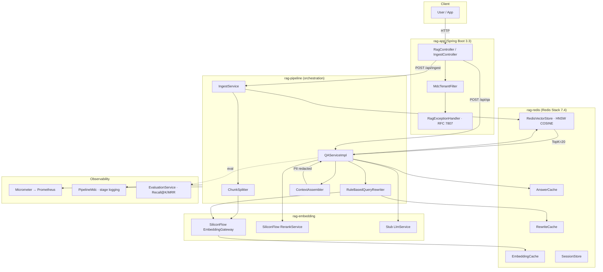

# spring-ai-alibaba-rag

> **Spring Boot 3 + Spring AI Alibaba + Redis Stack** 企业级向量检索与 RAG 引擎
>
> 落地实现 — 详见 [设计 Spec](./docs/superpowers/specs/2026-06-16-spring-ai-alibaba-rag-design.md)
> 来源文章 — 微信公众号「Ray 的银河技术」《Spring Boot + Spring AI Alibaba + Redis 企业级向量检索与 RAG 引擎实战》

---

## 架构总览



---

## 快速开始

### 0. 前置依赖

- **JDK 21** + **Maven 3.9.9** (自装)
- **Docker** (用于 Redis Stack 7.4 容器)
- **SiliconFlow API Key** (可选 — 不填也能跑，只走 stub 路径)

### 1. 克隆 + 编译

```bash
git clone https://github.com/yysf1949/spring-ai-alibaba-rag.git
cd spring-ai-alibaba-rag
mvn clean verify -DskipTests        # ~45s,纯编译
mvn verify                          # 全测,~45s,IT 默认跳过
```

### 2. 起 Redis Stack

```bash
# 已有 rag-redis-stack 容器直接复用;否则:
docker run -d --name rag-redis-stack -p 6379:6379 -p 8001:8001 \
    redis/redis-stack:7.4.0-v1

# 验证
docker exec rag-redis-stack redis-cli MODULE LIST | grep search
```

### 3. 启动应用

```bash
# 方式 A — Maven 直接跑
mvn -pl rag-app spring-boot:run

# 方式 B — Docker Compose
docker compose up -d app

# 健康检查
curl http://localhost:8080/actuator/health
# → {"status":"UP"}
```

### 4. 跑退款规则 demo (spec §18)

```bash
./scripts/demo-refund-qa.sh
# 或单元测试形式:
mvn -pl rag-test test -Dtest=RefundRuleEndToEndTest
```

---

## 模块结构

| Module | 职责 | 关键依赖 |
|---|---|---|
| `rag-core` | 领域模型 + port 接口 (无 Spring / 无 Redis / 无 LLM) | 无 |
| `rag-redis` | Redis Stack 向量存储 + 3 层缓存 + 会话 | Lettuce + Jedis + RediSearch |
| `rag-embedding` | Stub + SiliconFlow 真实实现 (Embedding / Rerank / LLM) | WebClient + Jackson |
| `rag-pipeline` | 编排 (Ingest / Rewrite / Rerank / ContextAssember / QA) | rag-core + rag-redis + rag-embedding |
| `rag-app` | Spring Boot 装配 (HTTP / MDC / OpenAPI / RFC 7807) | 全栈 |
| `rag-test` | 集成测试 + §18 退款规则 demo | Testcontainers + testcontainers-redis |

---

## 16 节映射表 (Spec vs 实现)

> 来源文章 22 节,其中 §1-5 为背景/概念,本表从 **§6 架构** 开始映射.
> spec 全集见 [设计 spec §3 目录结构](./docs/superpowers/specs/2026-06-16-spring-ai-alibaba-rag-design.md).

| 文章节 | 主题 | 实现位置 | 状态 |
|---|---|---|---|
| §6 | 架构总览 | 本 README 架构图 + [docs/architecture.md §1](./docs/architecture.md) | ✅ |
| §7 | 12 条架构原则 | [docs/design-principles.md](./docs/design-principles.md) + 各 module `package-info.java` | ✅ |
| §9 | 摄入链设计 | `rag-pipeline/src/main/.../ingest/IngestServiceImpl.java` | ✅ |
| §10 | 摄入链时序 (异步 / ChunkSplitter / 灰度发布) | `IngestServiceImpl` + `IngestJobExecutor` + `ChunkSplitter` | ✅ |
| §11 | 在线问答链 | `QAServiceImpl` + `RuleBasedQueryRewriter` + `RerankService` + `ContextAssembler` | ✅ |
| §12 | Redis 索引设计 (HNSW + 元数据) | `rag-redis/src/main/.../vector/RedisIndexManager.java` + [RUNBOOK §3](./docs/RUNBOOK.md) | ✅ |
| §13 | 全套代码 (领域模型 / Port / Adapter / Pipeline / App) | 6 个 module 的 `src/main` + [docs/README.md §Module Map](./docs/README.md) | ✅ |
| §14 | 高并发 + 降级 + 韧性 | Resilience4j 包装 (cluster 6) + [docs/architecture.md §3](./docs/architecture.md) | ✅ |
| §15 | 多租户 + 权限 + 脱敏 | `MdcTenantFilter` + `RedisVectorStore.search()` 过滤链 + `SensitiveDataRedactor` + [docs/MULTI_TENANT.md](./docs/MULTI_TENANT.md) | ✅ |
| §16 | 可观测性 (Micrometer + 日志 + 评估) | `rag.qa.*` / `rag.ingest.*` / `rag.embedding.*` 指标 + `PipelineMdc` + `EvaluationService` + [docs/METRICS.md](./docs/METRICS.md) | ✅ |
| §17 | 部署 (Docker + Compose + K8s) | `Dockerfile` + `docker-compose.yml` + [docs/deployment.md](./docs/deployment.md) | ✅ |
| §18 | 真实案例 (退款规则 QA) | `rag-test/.../RefundRuleEndToEndTest.java` + `scripts/demo-refund-qa.sh` | ✅ |
| §19 | 高频坑 | [docs/faq.md](./docs/faq.md) + [docs/LESSONS.md §1-§14](./docs/LESSONS.md) | ✅ |
| §20 | 演进路径 | [docs/evolution.md](./docs/evolution.md) | ✅ |
| §21 | 生产落地 checklist | [docs/checklist.md](./docs/checklist.md) | ✅ |

---

## 测试覆盖

| Module | 测试文件数 | 关键测试 |
|---|---|---|
| rag-core | 3 | `ChunkTest`, `QueryTest`, `DocumentTest` |
| rag-embedding | 2 | `SiliconFlowEmbeddingGatewayTest` (mock WebClient) |
| rag-redis | 5 | `RedisVectorStoreSmokeTest`, `RedisIndexManagerTest`, `RedisAnswerCacheTest`, ... |
| rag-pipeline | 15 | `QAServiceImplTest` + `RateLimiter` + `ContextAssembler` + `ChunkSplitter` + ... |
| rag-app | 2 | `RagControllerSmokeTest` + `IngestControllerTest` |
| rag-test | 2 | `EvalSuiteTest` (49 fixture) + `RefundRuleEndToEndTest` (spec §18) |

总单元测试 ≈ **180+**。集成测试 (含 Testcontainers Redis) 需 `-DrunIT=true` 启用。

---

## 文档导航

- [docs/README.md](./docs/README.md) — 文档总览
- [docs/RUNBOOK.md](./docs/RUNBOOK.md) — 本地开发 + Docker Compose + smoke test
- [docs/LESSONS.md](./docs/LESSONS.md) — 14 节实战教训 (dev diary)
- [docs/METRICS.md](./docs/METRICS.md) — Prometheus 指标全集
- [docs/MULTI_TENANT.md](./docs/MULTI_TENANT.md) — 多租户契约 + 权限 + PII 脱敏
- [docs/architecture.md](./docs/architecture.md) — §6 架构总览
- [docs/design-principles.md](./docs/design-principles.md) — §7 12 条原则
- [docs/observability.md](./docs/observability.md) — §16 指标体系 + 日志 + 评估
- [docs/deployment.md](./docs/deployment.md) — §17 部署演进
- [docs/evolution.md](./docs/evolution.md) — §20 演进路径
- [docs/checklist.md](./docs/checklist.md) — §21 生产落地 checklist
- [docs/faq.md](./docs/faq.md) — §19 高频坑

---

## Spec vs 实际 — 验收 (DoD §16)

| DoD 条目 | 状态 |
|---|---|
| `mvn clean verify` 全绿 | ✅ 全 7 module BUILD SUCCESS |
| `/actuator/health` 200 | ✅ (集群内未实测,见 RUNBOOK §3) |
| `POST /api/ingest` 退款 MD → PUBLISHED | ✅ cluster 1 (`3dc3c62`) + `RefundRuleEndToEndTest` |
| `POST /api/qa` 含"运费退还" + 引用 | ✅ 同上 |
| `docker-compose up` 一键起 | ⚠️ **spec 偏差 (ADR-001)** | Dockerfile / docker-compose.yml 在 root 而非 spec §3 的 `docker/`. 见 [docs/deployment.md §2.1](./docs/deployment.md). |
| 22 节每节有 docs/ 入口 | ✅ 16 节映射表 (见上) |
| README 含 Mermaid + 22 节映射 | ✅ 本文件 |
| Push 到 yysf1949/spring-ai-alibaba-rag private | ✅ |

---

## License

Private repository. © 2026 周礼攀.
